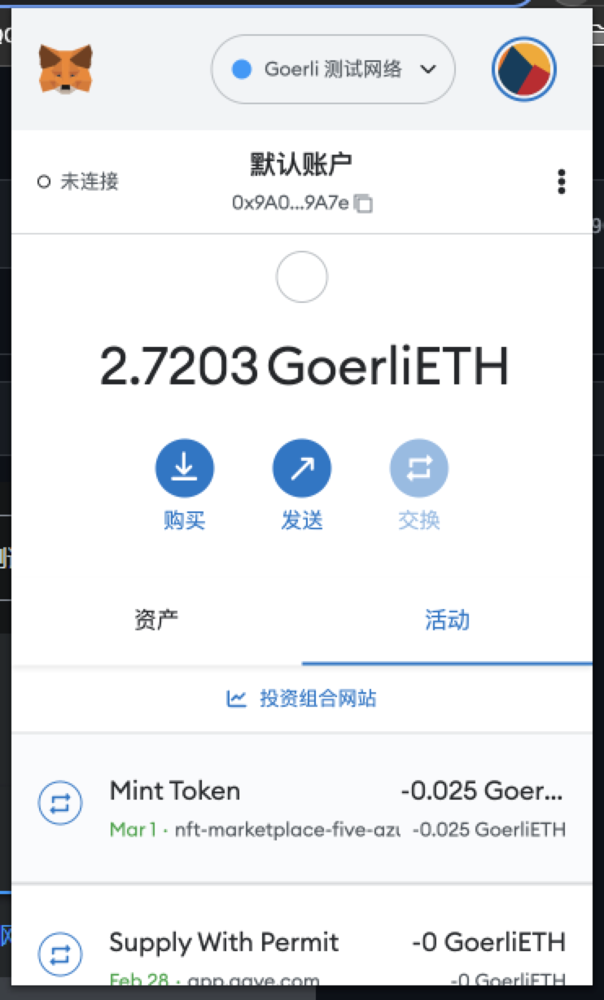

## 作业
#### 1.metamask

#### 2.tx hash
https://goerli.etherscan.io/tx/0x891853e8b9e554d1a2f7a259363456c1950991ca8fe93547bf0d47fa0d39abe6

#### 2.Counter.sol
https://goerli.etherscan.io/address/0x1d607783e1649bd53c94ea2c2e1d0ae0aa6315a6#code

## 总结

#### 1.remix 连接本地项目
[remix 连接本地项目](https://blog.csdn.net/weixin_45719444/article/details/122450555)

#### 2.etherscan手动验证源码

etherscan手动验证了源码，有点麻烦。验证记录：
https://goerli.etherscan.io/verifyContract-solc?a=0x1d607783e1649bd53c94ea2c2e1d0ae0aa6315a6&c=v0.8.7%2bcommit.e28d00a7&lictype=3