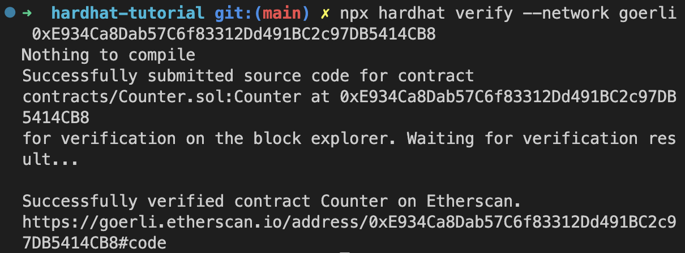

## 作业

#### 1.本地测试用例

[Counter.js](./hardhat-tutorial/test/Counter.js)

#### 2.部署

https://goerli.etherscan.io/address/0xe934ca8dab57c6f83312dd491bc2c97db5414cb8#code

#### 3.验证

## 总结

#### 1.上手教程

https://hardhat.org/tutorial/deploying-to-a-live-network

#### 2.部署到 goerli

https://hardhat.org/tutorial/deploying-to-a-live-network#deploying-to-remote-networks

#### 2.开源验证

https://hardhat.org/hardhat-runner/docs/guides/verifying
