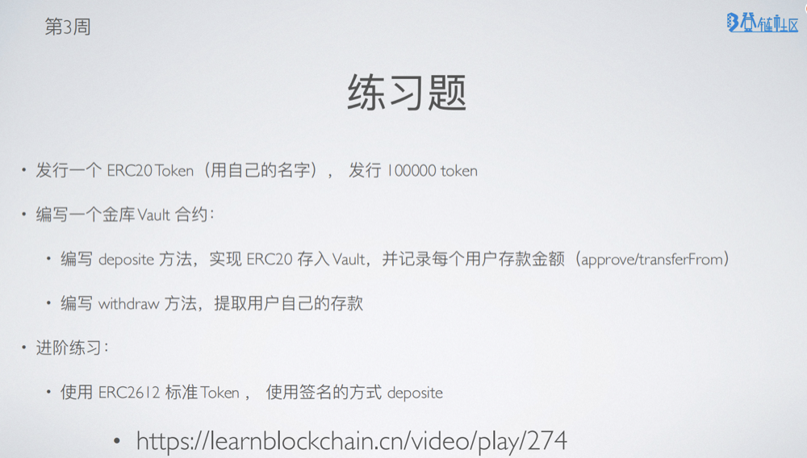
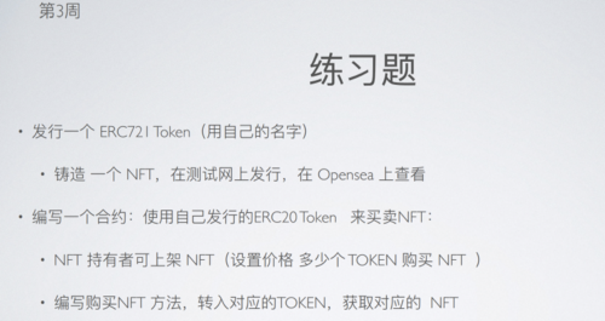

## 作业

### 作业 1

#### 1.合约

代币合约：[GAGA.sol](./hardhat-vault/contracts/GaGa.sol)

金库合约：[Vault.sol](./hardhat-vault/contracts/Vault.sol)

#### 2.测试用例

[Vault.js](./hardhat-vault/test/Vault.js)

### 作业 2

#### 1.合约

Nft 市场合约：[NftMarket.sol](./hardhat-nft-market/contracts/NftMarket.sol)

#### 2.测试用例

[Vault.js](./hardhat-nft-market/test/NftMarket.js)

#### 3.opensea 测试网查看

[testnets.opensea.png](./testnets.opensea.png)

## 总结

本想直接使用 `ERC20Permit.sol`、`ERC4626.sol` 来部署，但这个两个是抽象合约，还是要手动继承实现一下。Permit 验证签名参考：https://github.com/t4sk/hello-erc20-permit

- Fundry Permit 验证示例参考：https://github.com/xilibi2003/training_camp_2/blob/answer/w3_code/test/ERC2612.t.sol

- 前端 Permit 验证示例：https://github.com/xilibi2003/training_camp_2/blob/answer/w3_2_code/vue-project/src/components/ERC20.vue
