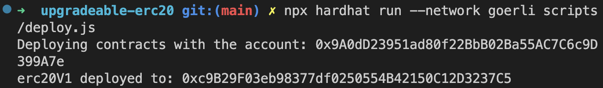
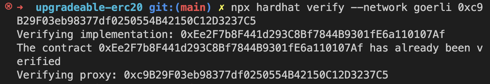

## 作业

#### 1.合约
ERC20V1：[ERC20V1.sol](./upgradeable-erc20/contracts/ERC20V1.sol)

ERC20V2：[ERC20V2.sol](./upgradeable-erc20/contracts/ERC20V2.sol)

#### 2.部署验证
[代理合约地址](https://goerli.etherscan.io/address/0xc9B29F03eb98377df0250554B42150C12D3237C5)

[逻辑合约地址](https://goerli.etherscan.io/address/0xEe2F7b8F441d293C8Bf7844B9301fE6a110107Af)

部署合约：得到的是代理合约地址。

验证合约：会先给你验证逻辑合约地址，再验证代理合约的代码。

#### 3.测试用例
[UpgradeableErc20.js](./upgradeable-erc20/test/UpgradeableErc20.js)

## 总结

看了 @openzeppelin/hardhat-upgrades 源码。 
* @openzeppelin/hardhat-upgrades/src/deploy-proxy.ts
* @openzeppelin/hardhat-upgrades/src/upgrade-proxy.ts

调用 `upgrades.deployProxy`，先部署逻辑合约，再部署ProxyAdmin合约，再由ProxyAdmin部署 TransparentUpgradeableProxy 代理合约，返回的是TransparentUpgradeableProxy代理合约地址。

为了给代理合约初始化值，可以在逻辑合约里定义 `initialize` 函数，`deployProxy` 在部署代理合约时会 `delegatecall` 调用`initialize` 进行初始化。

而在 `upgradeProxy` 中，调用 ProxyAdmin 的 `admin.upgradeAndCall` 或 `admin.upgrade` 进行升级。

部署之后想看代理合约代码是怎样的，可以部署到goerli然后验证查看。而想查看 ProxyAdmin 的地址，可以在交易的log中查看到：
https://goerli.etherscan.io/tx/0x964befbe11877376337fde08dedc3e041299722f06181d07a766ea0b5e55c784#eventlog

在 [ProxyAdmin](https://goerli.etherscan.io/address/0xAc84124DA5CAD0F23D6cC07BB5d1499eAEb66554#readContract) 中输入代理合约地址[0xc9B29F03eb98377df0250554B42150C12D3237C5]可以调用代理合约上的方法。

### 参考

* https://docs.openzeppelin.com/upgrades-plugins/1.x/
* https://learnblockchain.cn/article/5167
* https://docs.openzeppelin.com/contracts/4.x/wizard