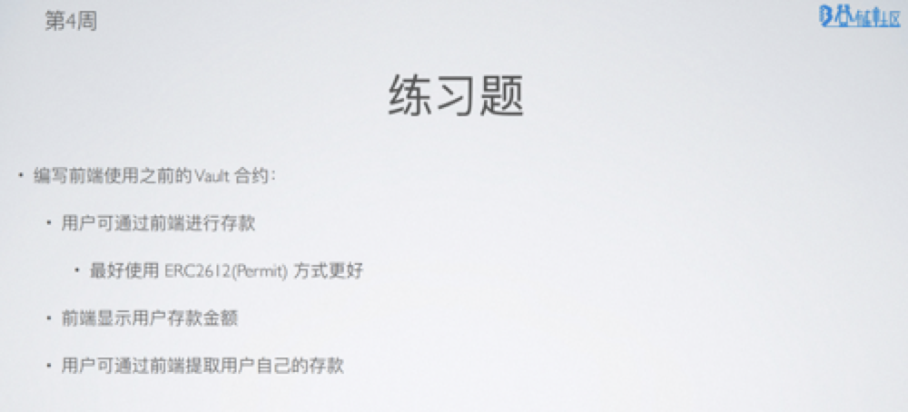
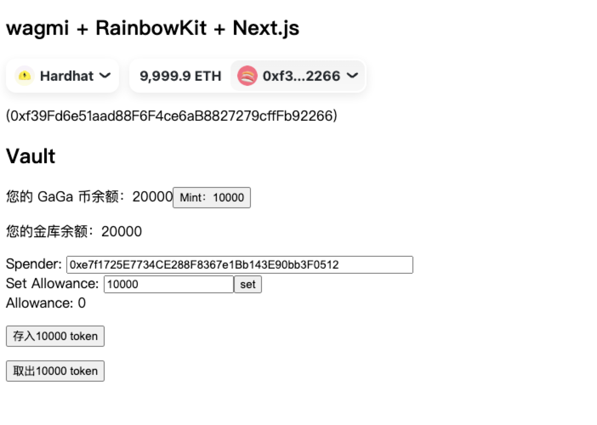

# 作业1


### 1.页面截图



# 作业2


练习ethers对事件监听的操作：

示例1：查询Transfer事件
```js
// WETH ABI，只包含我们关心的Transfer事件
const abiWETH = [
  "event Transfer(address indexed from, address indexed to, uint amount)"
];

// WETH合约地址（goerli测试网）
const addressWETH = '0xb4fbf271143f4fbf7b91a5ded31805e42b2208d6';
const contract = new ethers.Contract(addressWETH, abiWETH, goerliProvider);
const block = await goerliProvider.getBlockNumber();

// https://docs.ethers.org/v5/api/contract/contract/#Contract-queryFilter
const transferEvents = await contract.queryFilter('Transfer', block - 10, block);
// 打印第1个Transfer事件
console.log(transferEvents[0]);
```

示例2：监听Transfer事件

```js
// USDT的合约地址
const contractAddress = '0xdac17f958d2ee523a2206206994597c13d831ec7'
// 构建USDT的Transfer的ABI
const abi = [
  "event Transfer(address indexed from, address indexed to, uint value)"
];
// 生成USDT合约对象
const contractUSDT = new ethers.Contract(contractAddress, abi, mainnetProvider);

// 只监听一次
console.log("\n1. 利用contract.once()，监听一次Transfer事件");
contractUSDT.once('Transfer', (from, to, value) => {
  // 打印结果
  console.log(
    `${from} -> ${to} ${ethers.utils.formatUnits(ethers.BigNumber.from(value), 6)}`
  )
});

// 持续监听USDT合约。貌似会一下子输出一个区块所有的该事件？
console.log("\n2. 利用contract.on()，持续监听Transfer事件");
contractUSDT.on('Transfer', (from, to, value) => {
  console.log(
    // 打印结果
    `${from} -> ${to} ${ethers.utils.formatUnits(ethers.BigNumber.from(value), 6)}`
  )
})
```

示例3：indexed筛选，监听对应Transfer事件
```js
const filterBinanceIn = contractUSDT.filters.Transfer(null, accountBinance); // 带有过滤的事件搜索，这里没有指定区块范围？
console.log("过滤器详情：\n", filterBinanceIn);

// 半天监听不到入金
contractUSDT.on(filterBinanceIn, (from, to, value) => {
  console.log('---------监听USDT进入交易所--------');
  console.log(
    `${from} -> ${to} ${ethers.utils.formatUnits(ethers.BigNumber.from(value), 6)}`
  )
}).on('error', (error) => {
  console.log(error);
})
```
# 总结

## 作业1
wagmi全称：We are all gonna make it，wagmi是一个React Hooks的集合，包含与以太坊交互所需的一切。

项目使用 wagmi 的脚手架 [create-wagmi](https://github.com/wagmi-dev/create-wagmi) 进行创建，使用的模板是 next-rainbowkit。

使用 [hardhat-abi-exporter](https://www.npmjs.com/package/hardhat-abi-exporter) 插件，导入到配置中后，运行 `npx hardhat export-abi` 后导出 abi 供前端使用。

使用 [@wagmi/cli](https://wagmi.sh/cli/getting-started) 生成配置文件，可以添加一些扩展插件。

## 作业2

参考 https://github.com/WTFAcademy/WTF-Ethers/tree/main/07_Event