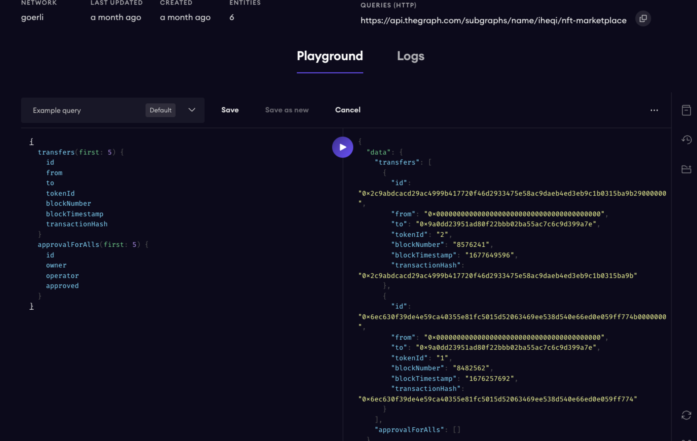
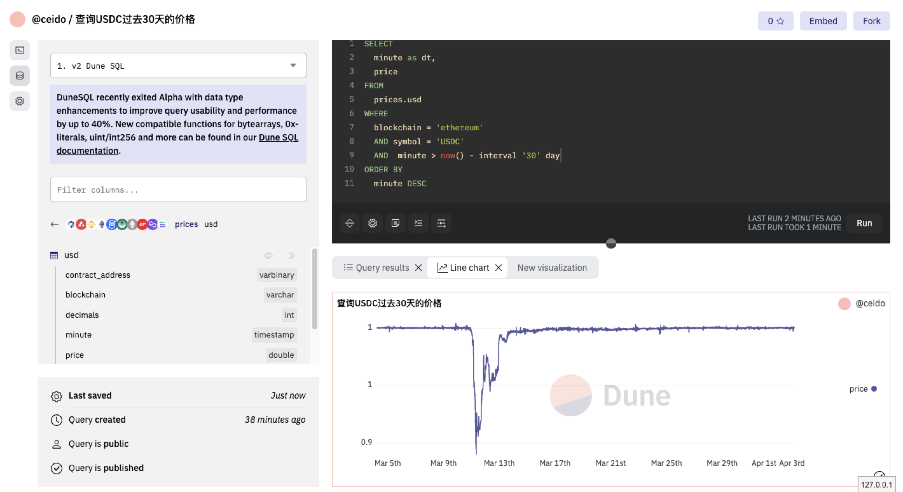

## 作业

### 作业 1

按照教程部署即可：

总结 TheGraph 写了一篇博客：https://www.jianshu.com/p/06c4fc5fbc03

### 作业 2

查询步骤：

1. 登录注册账号
2. 在首页点击 New query 建立查询
3. 在 Dune 里有 prices.usd 这个表，包含各种主流的币的价格
4. 编写 SQL，从表中查询其 minute、price 字段，并且设置 30 天时间
5. 等待查询，结果如下：

6. 点击 Save 可以保存这个查询，方便以后使用。
   https://dune.com/queries/2320175
