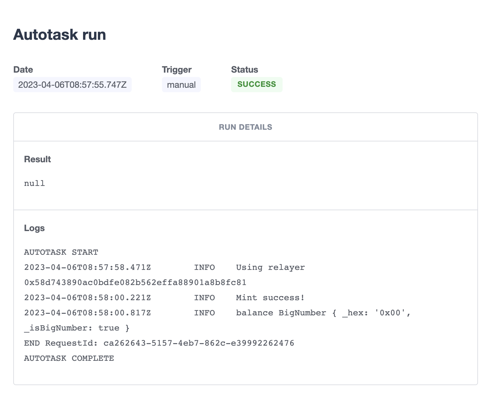

## 作业

### 作业

由于前两种都需要额外部署合约，goerli gas 费也很高，没多少 ETH 了，所以采用第三种 [OpenZepplin Defender](https://defender.openzeppelin.com/)。

Defender 是 OpenZeppelin 的一个产品，它是为安全的智能合约自动化而制作的，支持第一层区块链、第二层区块链和侧链。

OpenZeppelin Defender 提供了以下与智能合约自动化相关的功能：

- Admin：实现了对智能合约流程的透明管理，如访问控制（对资产的管理权）、升级（修复遇到的错误或应用新的服务）和暂停（使用暂停功能）。
- Relay：允许创建 Relayers（外部拥有的账户），轻松地保护你的私人 API 密钥，用于签署、管理（发送）你的交易，以及执行诸如 Gas 价格上限的政策
- Autotasks：连接到 Relayers，允许用 JavaScript 编写和调度代码脚本，这些脚本将在外部网络 API 或第三方服务的帮助下定期在智能合约上运行。
- Sentinel：监视你的智能合约的交易，并根据指定的条件、功能或事件提供交易的通知。
- Advisor：帮助你掌握最新的安全最佳实践，包括实施智能合约开发、监控、操作和测试的安全程序。

使用步骤：

1. 在 https://www.openzeppelin.com/defender
   网站进行登录注册
2. 创建一个中继（Relay）。
3. 创建了中继后，再创建 API Key。会给你一个以太坊地址、 API KEY 及 Secret Key。保存好。
4. 发送一点 ETH 到这个 Relay 账户，用作交易手续费

5. 创建一个自动任务 AutoTask，连接到刚刚创建的 Relayer
6. 编写 Code，简单起见，编写一段自动 mint GaGa 币逻辑
7. 点击 create 进行创建

任务执行结果截图：

## 总结

编写 code 很麻烦，容易出错。

### 参考

- [使用 Automation、Gelato 和 Defender 进行合约自动化执行](https://learnblockchain.cn/article/5618)
- W5-1: `https://img.learnblockchain.cn/pdf/camp2/w5-1.pdf`
- [合约自动化调用工具 - Chainlink Automation, Gelato, OpenZepplin Defender](https://learnblockchain.cn/video/play/373)
